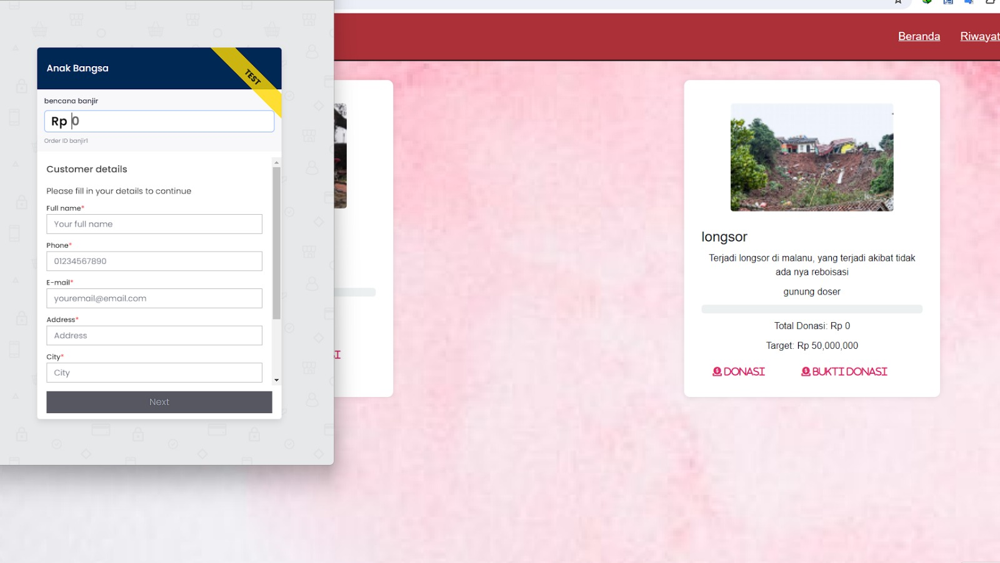

# Aplikasi Donasi Anak Bangsa

Aplikasi Donasi Anak Bangsa adalah aplikasi sederhana berbasis PHP native untuk menggalang dana dan donasi bagi anak-anak yang membutuhkan. Aplikasi ini menggunakan Payment Gateway Midtrans untuk memproses pembayaran secara aman dan efisien.

## Fitur

- **Halaman Utama:**
  - Tampilan beranda dengan informasi mengenai tujuan donasi dan kegiatan amal.

- **Donasi:**
  - Form donasi sederhana untuk pengguna menginput jumlah donasi dan data pribadi.

- **Pembayaran:**
  - Pengguna akan dialihkan ke halaman pembayaran Midtrans untuk menyelesaikan transaksi.

- **Konfirmasi Donasi:**
  - Halaman konfirmasi setelah pembayaran berhasil dengan rincian donasi.



## Instalasi

1. Clone repositori ini ke dalam direktori web server Anda.

    ```bash
    git clone https://github.com/arfianaja/Donasi_anak_bangsa.git
    ```

2. Buat database MySQL baru dan import skema yang ada di dalam folder `database`.

3. Konfigurasikan koneksi database. Edit file `config.php` pada folder `includes`.

    ```php
    define('DB_HOST', 'localhost');
    define('DB_USER', 'username');
    define('DB_PASSWORD', 'password');
    define('DB_NAME', 'nama_database');
    ```

4. Daftar dan dapatkan kunci API Midtrans di [Midtrans Dashboard](https://dashboard.midtrans.com/).

5. Konfigurasikan kunci API Midtrans. Edit file `config.php` pada folder `includes`.

    ```php
    define('MIDTRANS_SERVER_KEY', 'your_server_key');
    define('MIDTRANS_CLIENT_KEY', 'your_client_key');
    ```

6. Buka aplikasi pada browser dan mulai menggalang donasi!

## Penggunaan

1. Akses aplikasi melalui browser.

2. Pilih menu "Donasi" untuk melakukan kontribusi.

3. Isi formulir donasi dengan jumlah yang diinginkan dan data pribadi Anda.

4. Pilih metode pembayaran dan lakukan proses pembayaran melalui halaman Midtrans.

5. Setelah pembayaran berhasil, Anda akan diarahkan ke halaman konfirmasi donasi.
